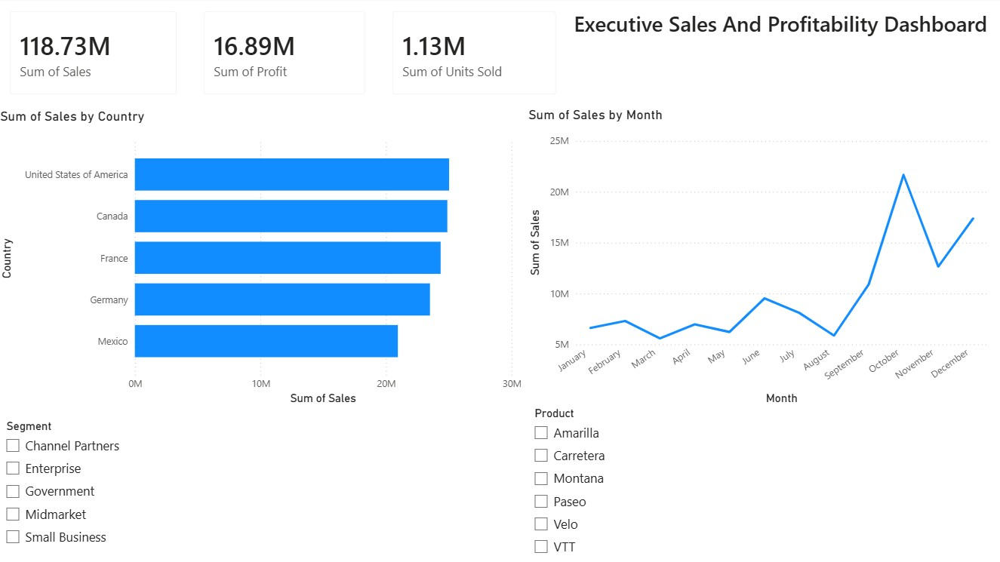
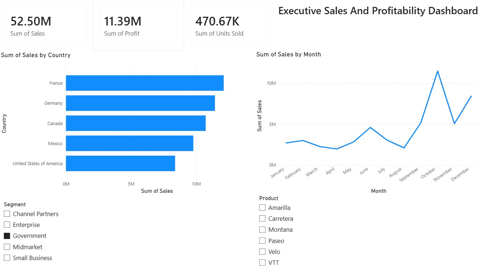

# Executive Sales & Profitability Dashboard (Power BI)

## 📌 Project Overview
An interactive Power BI report analyzing sales distribution across international markets, product segments, and seasonal timeframes. Built to deliver clear, actionable metrics for executive leadership.

## 🛠️ Tools Used
* **Power BI Desktop:** Data modeling, visual hierarchy, dynamic filtering, and interactive slicers.
* **Source Data:** Financial performance sample dataset.

## 📊 Core Features & Visuals
1. **Executive KPI Cards:** Instant tracking of Total Revenue ($118.73M), Total Profit ($16.89M), and Total Units Sold (1.13M).
2. **Geographic Distribution:** Clustered bar chart breaking down top-performing countries (USA, Canada, France, Germany, Mexico).
3. **Monthly Trend Analysis:** Line chart mapping revenue movement across all 12 calendar months, highlighting key Q4 spikes.
4. **Interactive Filters:** Multi-category slicers allowing real-time cross-filtering by customer **Segment** and **Product**.

## 💡 Key Business Insights
* **Market Dominance:** USA leads overall revenue generation (~$25M), with Canada and France following closely.
* **Government Impact:** Filtering by the Government segment accounts for ~$52.50M (nearly 44% of total revenue), where France leads as the top country.
* **Seasonal Peak:** Sales experience a sharp spike during October ($20M+), signaling strong Q4 momentum.

## 📷 Dashboard Preview

### Unfiltered Overview

### Segment Filtered View (Government)

